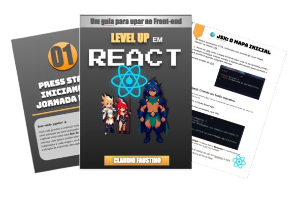

    

---

# Projeto EBOOK Gerado por I.A.s
---
Projeto com o objetivo de gerar um ebook digital com as facilidades das ferramentas de IA. todos os prompts
seguem abaixo.

<a href="https://github.com/fclaudio051/projetos/Aritigos/Ebook/Dio/output/ebookReact.pdf"> 📕Clique aqui para ler</a>

## 💻 Tecnologias utilizadas no projeto

- [ChatGPT](https://chat.openai.com/)
- [piclumen](https://www.piclumen.com/pt/ai-art-generator/pixel/)
- [Slider](https://docs.google.com/presentation/u/0/)

## 🧠 Prompts

ChatGPT：

|   Ação   | prompt                                                                                                                                                                                                                                                                                                                                                              |
| :------: | ------------------------------------------------------------------------------------------------------------------------------------------------------------------------------------------------------------------------------------------------------------------------------------------------------------------------------------------------------------------- |
|  título  | Crie um título de um ebook chamativo com alusão a RPG para um ebook de React.                                                                                                                                                                                                                                                                                       |
| conteúdo | Faça um texto para ebook , com foco em React, listando as principais informações sobre a ferramenta e seu uso, exemplos em código {REGRAS} Explique sempre de uma maneira simples e divertida, Deixe o texto enxuto mas não cansativo, Sempre traga exemplos de código em contextos reais , sempre deixe um título sugestivo por tópico focando nas alusões de RPG. |

PicLumen：

|  Ação  | prompt                                                    |
| :----: | --------------------------------------------------------- |
| título | Guerreiros em estilo jogo de RPG em estilo de pixel arte. |

## ✨ Features

- Conteúdo gerado via ChatGPT
- Imagens geradas via PicLumen

## 📚 Materiais

- Imagens utilizadas em `assets`
- ebook gerado durante as aulas em `output`

## 🛠️ Instruções de execução

Utilize os prompts acima nas ferramentas sugeridas para gerar o material base e utilize uma ferramenta de edição de documentos como power point, libreoffice , indesign para diagramação.

## 👨‍💻 Expert

    
    
&nbsp&nbsp&nbspFelipe Aguiar 
    &nbsp&nbsp&nbsp
    <a href="https://github.com/fclaudio051/">
    GitHub</a>&nbsp;|&nbsp;
    <a href="http://www.linkedin.com/in/claudiofaustinodev">LinkedIn</a>
&nbsp;|&nbsp;

  

---

⌨️ com 💜 por [Claudio Faustino](https://github.com/fclaudio051/)
